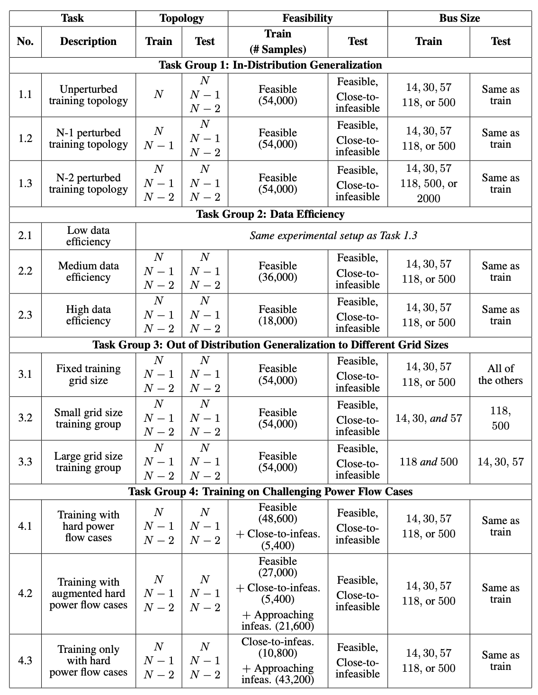

# PFΔ Dataset
PFΔ is a benchmark dataset for power flow that captures diverse variations in load, generation, and topology. It contains 850,500 solved power flow instances spanning six different bus system sizes, capturing three types of contingency scenarios (N, N-1, and N-2), and including close-to-infeasible cases near steady-state voltage stability limits. Our dataset is available at: https://huggingface.co/datasets/pfdelta/pfdelta/tree/main. Our paper is available at: INSERT LINK HERE. 

# Dataset Overview

The dataset includes solved power flow instance for the following power systems tests cases: IEEE 14-bus, IEEE 30-bus, IEEE 57-bus, IEEE 118-bus, GOC 500-bus, and GOC 2000-bus. For test case we provide multiple topological configurations:
- N: original (unperturbed) topology
- N-1: single-component outage scenarios
- N-2: double-component outage scenarios


For each test case, we include solved power flow instances produced through our data generation workflow (see **Figure 1**), as well as approaching infeasible and close-to-infeasible samples produced through continuation power flow.

<p align="center" style="background-color:white; padding:10px;">
  
</p>

<p align="center"><b>Figure 1.</b> Data generation pipeline.</p>

The following Tables summarizes the amount of samples provided for each test case: 
<p align="center" style="background-color:white; padding:10px;">
  
</p>

<p align="center">
  <b>Table 1.</b> Number of training samples generated for each network topology and system size.
</p>

<p align="center" style="background-color:white; padding:10px;">
  
</p>

<p align="center">
  <b>Table 2.</b> Number of test samples generated for each network topology and system size.
</p>

# Standardized Evaluation Tasks

We provide a set of standardized evaluation tasks to evaluate in- and out-of-distribution performance, data efficiency, and performance on close-to-infeasible cases. The summary of all evaluation tasks is shown in the following table:

<p align="center" style="background-color:white; padding:10px;">
  
</p>

<p align="center">
  <b>Table 3.</b> Standardized evaluation tasks included for PFΔ.
</p>

Each task defines a specific evaluation setting, but any of the provided datasets can be used with these tasks to benchmark model performance under different conditions.  The only exception is the GOC 2000-bus system due to the limited number of available samples.


# PFΔ Usage Guide 

### Requirements 
--------------------

The Python packages required to use the PFΔ dataset and reproduce the paper's results are listed in `requirements.txt`. Install them with:
```bash
pip install -r requirements.txt
```

If you want to use the data generation framework or verify power flow solutions, install the Julia packages listed in `data_generation/Project.toml`:
```bash
julia --project=data_generation -e 'using Pkg; Pkg.instantiate()'
```

**Note:** Julia dependencies are only required for data generation and validation. They are not needed to load and use the pre-generated dataset.

### Dataset Class Usage 
--------------------

The `PFDeltaDataset` class can be instantiated to automatically download and load the dataset from Hugging Face.  
It handles fetching the data, verifying its integrity, and organizing samples for direct use in training or evaluation.  

For example, the dataset for **Task 1.3** using the **IEEE 118-bus system** can be created with the following Python script:

```python
from core.datasets.pfdelta_dataset import PFDeltaDataset

dataset = PFDeltaDataset(
    case_name="case118",
    task=1.3,
    root_dir="data"
)
```
We provide several notebooks to serve as a quick start guide to using the `PFDeltaDataset` `InMemoryDataset` and visualizing/analyzing our generated data: 

- [Learn how to download and work with `PFDeltaDataset` for your model](notebooks/dataset_quickstart_guide.ipynb): this notebook includes information on how to automatically download and unzip data from the HuggingFace repository and inherit the parent class for custom model data preprocessing. 
- [Visualize data diversity compared to other benchmark datasets](notebooks/box_plots.ipynb): This notebook allows you to visualize the spread of various features in our dataset in comparison to existing benchmark datasets. 
- [???](notebooks/julia_code_results.ipynb): ???

#### HeteroData Structure 

We provide a PyTorch `InMemoryDataset` class called `PFDeltaDataset` to load the raw data described in Appendix A.6. This dataset class is designed to support loading data for a specified task for with a given bus system size. Each raw data instance that we load is stored as a JSON file representing the power flow solution for a specific grid configuration. An example of what a HeteroData instance for this dataset looks like is provided below: 


    HeteroData(
      bus={
        x=[14, 2],
        y=[14, 2],
        bus_gen=[14, 2],
        bus_demand=[14, 2],
        bus_voltages=[14, 2],
        bus_type=[14],
        shunt=[14, 2],
        limits=[14, 2],
      },
      gen={
        limits=[5, 4],
        generation=[5, 2],
        slack_gen=[5],
      },
      load={ demand=[11, 2] },
      (bus, branch, bus)={
        edge_index=[2, 20],
        edge_attr=[20, 8],
        edge_label=[20, 4],
        edge_limits=[20, 1],
      },
      (gen, gen_link, bus)={ edge_index=[2, 5] },
      (bus, gen_link, gen)={ edge_index=[2, 5] },
      (load, load_link, bus)={ edge_index=[2, 11] },
      (bus, load_link, load)={ edge_index=[2, 11] }
    )


#### Directory Structure 

Once data from the Hugging Face repository is extracted, it will be organized as follows. It includes per-topology subfolders (n, n-1, n-2, etc.), each containing raw JSON samples, near-feasibility subsets (nose and around_nose), and model-specific processed tensors for training and evaluation. A top-level processed/ directory also provides combined, ready-to-use datasets across all topologies/task-relevant feasibilities for convenience. An example of what this directory structure would look like is provided below:

```markdown
pfdelta_data/
└── case57/
    ├── n-1/
    │   ├── raw/
    │   │   ├── sample1.json
    │   │   ├── sample2.json
    │   │   └── ...
    │   ├── processed/
    │   │   ├── task_1.3_feasible_{MODELNAME}/
    │   │   │   ├── train.pt
    │   │   │   └── test.pt
    │   │   ├── task_1.3_nearly_infeasible_{MODELNAME}/
    │   │   └── ...
    │   ├── nose/
    │   │   ├── sample1.json
    │   │   ├── sample2.json
    │   │   └── ...
    │   └── around_nose/
    │       ├── sample1.json
    │       ├── sample2.json
    │       └── ...
    ├── n/
    ├── n-2/
    └── ...
└── processed/
    └── combined_task_1.3_{MODELNAME}/
        ├── train.pt
        └── test.pt
```

### Result Replication
--------------------

To replicate the results presented in the paper, use the configuration files located in `core/configs/`.  Each YAML file corresponds to a specific model–task combination and follows the naming convention:

where  
- `{modelname}` ∈ [`pfnet`, `canos_pf`, `canos_opf`, ...]  
- `{tasknumber}` ∈ [`1.1`, `1.2`, `1.3`, ...]  

The models can be located in `core/models`.

For example, the following command retrains **PowerFlowNet** on **Task 1.3**:

```bash
python main.py --config pfnet_task_1_3
```
Additionally, a config file verifying the correct re-implementation of CANOS is included. Running any configuration file will automatically create a runs/ directory containing experiment outputs (e.g., runs/canos_pf_task_1_1_<YYMMDD_HHMMSS>). Its structure is as follows:

```bash 
runs/
└── modelname_task_#_#_<YYMMDD_HHMMSS>/
    ├── config.yaml         # Model and training hyperparameters
    ├── model.pt            # Trained model weights
    ├── out.txt             # Console log of training
    ├── summary.json        # Summary of training and validation losses
    ├── train.json          # Training loss per epoch
    └── val.json            # Validation loss every 2 epochs
``` 

The summary.json file can be used to quickly compare performance against the values reported in the paper. Note that the paper’s results are test-set errors averaged over three different random seeds, whereas the results in summary.json reflect validation losses from a single training run. As a result, minor discrepancies between the two are expected. 

In addition, we provide quick-start notebooks for training models and designing custom loss functions: 
- [Calculating Test Errors and Performing Model Inference](notebooks/julia_code_results.ipynb):
- [Designing Custom Loss Functions](notebooks/julia_code_results.ipynb): 

### Notes:
------
- All values are in per-unit (p.u.).
- All JSON files are compatible with PowerModels.jl for loading, solving, or further analysis.


### Citation:
------
If you use any of our model implementations, data generation code, dataset class, or benchmark, please consider citing us: 